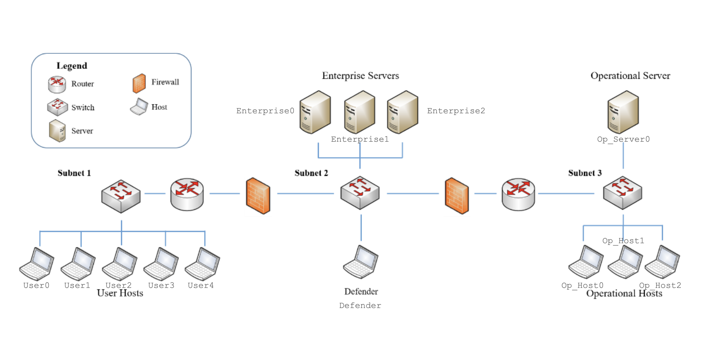

# Log to Vis Format

Create gifs using `gif_maker.py`

### Requirements:

```
matplotlib==3.4.3
```

## Raw logs

We expect the files to start with a couple of arbitrary lines before the initial state table for the environment. 

You can acquire the truth table output by adding the following lines to your evaluation or training scripts:

```
# Print true table on each step
true_state = cyborg.get_agent_state('True')
true_table = true_obs_to_table(true_state,cyborg)
print(true_table)
```


This is the one for `Scenario1b`:

```
+-----------------+--------------+-------------+-------+---------+------------+
|      Subnet     |  IP Address  |   Hostname  | Known | Scanned |   Access   |
+-----------------+--------------+-------------+-------+---------+------------+
|  10.0.138.16/28 | 10.0.138.28  |   Defender  | False |  False  |    None    |
|  10.0.138.16/28 | 10.0.138.27  | Enterprise0 | False |  False  |    None    |
|  10.0.138.16/28 | 10.0.138.17  | Enterprise1 | False |  False  |    None    |
|  10.0.138.16/28 | 10.0.138.24  | Enterprise2 | False |  False  |    None    |
| 10.0.212.128/28 | 10.0.212.134 |   Op_Host0  | False |  False  |    None    |
| 10.0.212.128/28 | 10.0.212.136 |   Op_Host1  | False |  False  |    None    |
| 10.0.212.128/28 | 10.0.212.140 |   Op_Host2  | False |  False  |    None    |
| 10.0.212.128/28 | 10.0.212.141 |  Op_Server0 | False |  False  |    None    |
|  10.0.151.96/28 | 10.0.151.102 |    User0    |  True |  False  | Privileged |
|  10.0.151.96/28 | 10.0.151.109 |    User1    | False |  False  |    None    |
|  10.0.151.96/28 | 10.0.151.108 |    User2    | False |  False  |    None    |
|  10.0.151.96/28 | 10.0.151.103 |    User3    | False |  False  |    None    |
|  10.0.151.96/28 | 10.0.151.100 |    User4    | False |  False  |    None    |
+-----------------+--------------+-------------+-------+---------+------------+
----------------------------------------------------------------------------
```

It is then followed by the first step in the episode. Current iterations of the logs report some reward and action features, as seen below:

```
Blue Action: 9
Reward: 0.0, Episode reward: 0.0
Network state:
Scanned column likely inaccurate.
+-----------------+--------------+-------------+-------+---------+------------+
|      Subnet     |  IP Address  |   Hostname  | Known | Scanned |   Access   |
+-----------------+--------------+-------------+-------+---------+------------+
|  10.0.138.16/28 | 10.0.138.28  |   Defender  | False |  False  |    None    |
|  10.0.138.16/28 | 10.0.138.27  | Enterprise0 | False |  False  |    None    |
|  10.0.138.16/28 | 10.0.138.17  | Enterprise1 | False |  False  |    None    |
|  10.0.138.16/28 | 10.0.138.24  | Enterprise2 | False |  False  |    None    |
| 10.0.212.128/28 | 10.0.212.134 |   Op_Host0  | False |  False  |    None    |
| 10.0.212.128/28 | 10.0.212.136 |   Op_Host1  | False |  False  |    None    |
| 10.0.212.128/28 | 10.0.212.140 |   Op_Host2  | False |  False  |    None    |
| 10.0.212.128/28 | 10.0.212.141 |  Op_Server0 | False |  False  |    None    |
|  10.0.151.96/28 | 10.0.151.102 |    User0    |  True |  False  | Privileged |
|  10.0.151.96/28 | 10.0.151.109 |    User1    |  True |  False  |    None    |
|  10.0.151.96/28 | 10.0.151.108 |    User2    |  True |  False  |    None    |
|  10.0.151.96/28 | 10.0.151.103 |    User3    |  True |  False  |    None    |
|  10.0.151.96/28 | 10.0.151.100 |    User4    |  True |  False  |    None    |
+-----------------+--------------+-------------+-------+---------+------------+
----------------------------------------------------------------------------
.
----------------------------------------------------------------------------
Blue Action: 13
Reward: 0.0, Episode reward: 0.0
Network state:
Scanned column likely inaccurate.
+-----------------+--------------+-------------+-------+---------+------------+
|      Subnet     |  IP Address  |   Hostname  | Known | Scanned |   Access   |
+-----------------+--------------+-------------+-------+---------+------------+
|  10.0.138.16/28 | 10.0.138.28  |   Defender  | False |  False  |    None    |
|  10.0.138.16/28 | 10.0.138.27  | Enterprise0 | False |  False  |    None    |
|  10.0.138.16/28 | 10.0.138.17  | Enterprise1 | False |  False  |    None    |
|  10.0.138.16/28 | 10.0.138.24  | Enterprise2 | False |  False  |    None    |
| 10.0.212.128/28 | 10.0.212.134 |   Op_Host0  | False |  False  |    None    |
| 10.0.212.128/28 | 10.0.212.136 |   Op_Host1  | False |  False  |    None    |
| 10.0.212.128/28 | 10.0.212.140 |   Op_Host2  | False |  False  |    None    |
| 10.0.212.128/28 | 10.0.212.141 |  Op_Server0 | False |  False  |    None    |
|  10.0.151.96/28 | 10.0.151.102 |    User0    |  True |  False  | Privileged |
|  10.0.151.96/28 | 10.0.151.109 |    User1    |  True |   True  |    None    |
|  10.0.151.96/28 | 10.0.151.108 |    User2    |  True |  False  |    None    |
|  10.0.151.96/28 | 10.0.151.103 |    User3    |  True |  False  |    None    |
|  10.0.151.96/28 | 10.0.151.100 |    User4    |  True |  False  |    None    |
+-----------------+--------------+-------------+-------+---------+------------+
----------------------------------------------------------------------------
.
----------------------------------------------------------------------------
```

Each step is delimited. Parsing for these files can be run through `results_parser.py`


## Parsed Logs

Format returned from `results_parser.py` is a list of dictionaries containing the following:
- `hosts`: a list of the status of each node in the network/row of the table structured as follows:
	- `subnet` (str)
	- `ip_addr` (str)
	- `known` (Bool)
	- `scanned` (bool)
	- `access` (bool)
	- `hostname` (str)
- All except the first record (the starting state) contains the other features:
	- `blue_action` (currently an int, but soon to be a string)
	- `reward` (float)
	- `ep_reward` (float)


## Visualising the Network

Each hostname corresponds to a particular node in the graphic, as shown in this image:




